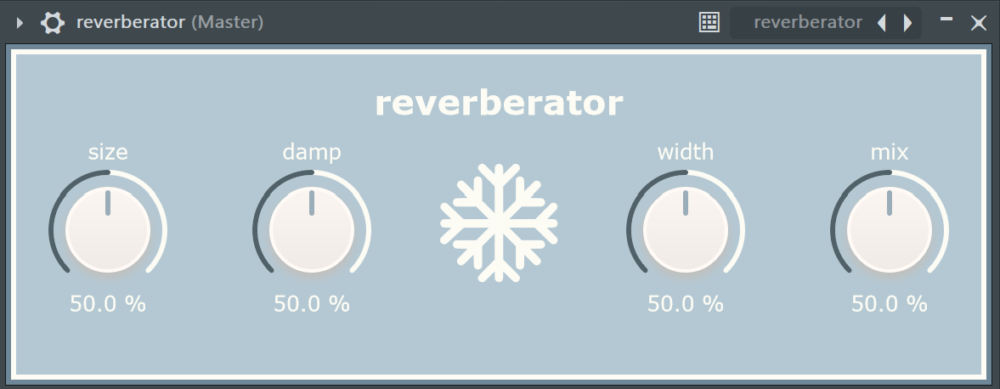

# reverberator

### a basic reverb plugin using the JUCE DSP module

### features:
- size parameter to change the size of the room being simulated
- damp parameter to adjust the softness of the emulated room
- freeze button to enable continuous feedback (use with caution)
- width parameter to alter the stero width of the reverb effect
- mix parameter to shape the overall reverb
- intuitive design layout

### building the VST3 file:

* [ ] [Download JUCE](https://juce.com/download/) if you don't already have it.

* [ ] `git clone` this repo and open the .jucer file with Projucer.

* [ ] Under the exporters tab, create an export target for your system/IDE.

* [ ] Open the exported project in your IDE and build a release version.
> [!NOTE]
> If you're building a Debug version, you may need to disable "copy plugin step" under debug settings. This can cause issues if the IDE does not have permission to write to the VST3 Binary Location.

* [ ] The VST3 file should now be available to use under Builds > (your IDE) > ... > Release

